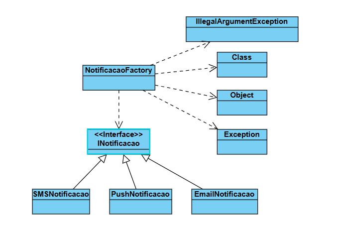

# Exemplo de Padrão de Projeto - Factory Method com Notificações
Este repositório contém uma implementação em Java do padrão de projeto criacional Factory Method, aplicado a um sistema de envio de notificações.

## Sobre o Padrão Factory Method
O Factory Method é um padrão de projeto que fornece uma interface para criar objetos em uma superclasse, mas permite que as subclasses alterem o tipo de objetos que serão criados. Esse padrão ajuda a desacoplar o código cliente das classes concretas que ele precisa instanciar. O cliente interage com uma interface e solicita um objeto a uma fábrica, sem precisar saber qual implementação específica será retornada.

## Sistema de Notificações
A implementação demonstra o padrão através de um sistema que pode enviar notificações por diferentes canais (Email, SMS e Push).

Interface: INotificacao, define o contrato comum para todas as notificações com o método enviar().

Implementações Concretas: EmailNotificacao, SMSNotificacao, PushNotificacao. Cada classe implementa a lógica específica para seu canal de envio.

Fábrica: NotificacaoFactory, uma classe com um método estático obterNotificacao() que recebe uma String (ex: "Email") e retorna a instância correta do notificador.

## Como Executar os Testes
O projeto utiliza Maven para gerenciamento de dependências e JUnit 5 para os testes unitários. Para executar todos os testes e verificar se a implementação está correta, utilize o comando do Maven na raiz do projeto:

```bash
mvn test
```

Alternativamente, você pode executar os testes diretamente pela sua IDE (como IntelliJ ou Eclipse).

## Diagrama de Classes
O diagrama abaixo ilustra a estrutura de classes para o exemplo do sistema de notificações, incluindo as dependências internas da fábrica para lidar com a criação de objetos e exceções.


